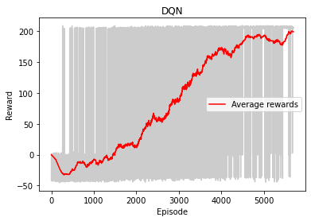

# MRS_Control_using_DQN
This work implements a decentralized control scheme on a multi-robot system where each robot is equipped with a deep Q-network (DQN) controller to perform an object transportation task. 
The task is for the two-robot system to carry a rod cooperatively outside the room, without crashing any of the walls. 

The DQN agent is trained using the homogeneous training algorithm [1] and evaluated. 

### DQN Agent 
Observation States - x, y, theta. \
Action - Move Up, Move Down, Move Left and Move Right.  \
If Reached goal, Reward = 200.
If Crashed wall, Reward = -40.

https://user-images.githubusercontent.com/86790696/124205171-ad349080-daae-11eb-9b98-b6fd0c1aaa02.mp4 

https://user-images.githubusercontent.com/86790696/124205206-c6d5d800-daae-11eb-8fb2-d2f808cecca9.mp4 

https://user-images.githubusercontent.com/86790696/124205212-c9d0c880-daae-11eb-9d8d-41ec8d549478.mp4 

This implementation is based on the publication [1] below in a python-gym version of the environment [2]. 
### References 
[1]  L. Zhang, Y. Sun, A. Barth and O. Ma, "Decentralized Control of Multi-Robot System in Cooperative Object Transportation Using Deep Reinforcement Learning," in IEEE Access, vol. 8, pp. 184109-184119, 2020, doi: 10.1109/ACCESS.2020.3025287. \
[2]  Environment by [LinZHank](https://github.com/irasatuc/gym-ae5117). \
Current implementation is a slightly customized version of the above mentioned environment.  
